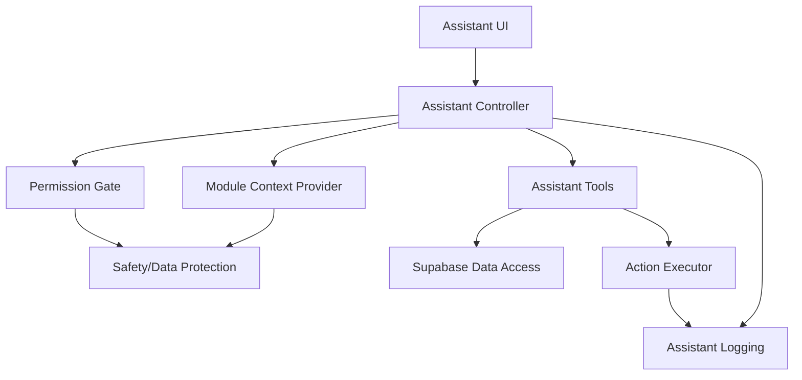

# Arquitectura Comun para Asistentes IA - AIFA Operaciones

Fecha: 2026-07-22

## 1. Proposito

Definir una arquitectura comun para construir asistentes IA dentro de AIFA Operaciones, tomando como referencia el asistente de agenda existente (`js/agenda-assistant.js`) y adaptandola a futuros modulos operativos.

Este documento es una base de diseno. No modifica la implementacion actual y no asume que todos los componentes existan ya en codigo.

## 2. Principios

- Todo asistente debe operar dentro del permiso real del usuario.
- El modo inicial debe ser lectura, explicacion y preparacion de borradores.
- Las acciones de escritura requieren confirmacion explicita.
- La IA debe distinguir dato confirmado, calculo e inferencia.
- Toda respuesta basada en datos debe citar modulo, tabla, documento o periodo usado.
- Ningun asistente debe saltarse RLS, `allowed_sections`, `section_levels` ni la compuerta de aplicacion `OPERACIONES`.
- Los asistentes deben ser modulares: agenda, operaciones, biblioteca, manifiestos, reportes, etc. no deben compartir estado sensible sin contrato.

## 3. Capas de Arquitectura



## 4. Componentes Reutilizables

### 4.1 Assistant UI

Responsable de la experiencia de usuario.

Componentes esperados:

- boton flotante o panel embebido;
- historial de conversacion;
- input de texto;
- boton de voz opcional;
- estado de carga;
- errores claros;
- lista de fuentes usadas;
- tarjetas de accion pendiente;
- confirmacion antes de ejecutar cambios;
- boton para limpiar contexto.

Reglas UI:

- No mostrar acciones que el usuario no puede ejecutar.
- Diferenciar respuestas informativas de acciones ejecutables.
- Mostrar "borrador" cuando la IA proponga texto, acuerdos, notas o reportes.
- Indicar fecha/periodo de datos usados.

### 4.2 Assistant Controller

Orquesta conversacion, contexto, permisos, herramientas y acciones.

Responsabilidades:

- recibir mensaje del usuario;
- cargar contexto del modulo activo;
- validar permisos;
- seleccionar herramientas permitidas;
- generar respuesta;
- preparar acciones si aplica;
- enviar eventos de logging.

Debe ser idempotente y no registrar listeners duplicados.

### 4.3 Module Context Provider

Cada modulo debe declarar que contexto puede entregar al asistente.

Contrato recomendado:

```js
window.AIFA_ASSISTANTS = window.AIFA_ASSISTANTS || {};
window.AIFA_ASSISTANTS["agenda"] = {
  section: "agenda",
  label: "Agenda",
  getContext: async function () {},
  tools: [],
  allowedActions: []
};
```

Contexto minimo por modulo:

- `section`: clave `data-section`;
- `label`: nombre visible;
- `userRole`: rol actual;
- `sectionLevel`: nivel por modulo;
- `dateRange`: periodo activo;
- `filters`: filtros activos;
- `visibleRows` o resumen;
- fuentes Supabase usadas;
- restricciones conocidas.

### 4.4 Permission Gate

Controla si el asistente puede ver datos o proponer acciones.

Entradas:

- usuario Supabase;
- `user_roles.role`;
- `permissions.allowed_sections`;
- `permissions.section_levels`;
- `permissions.area`;
- asignacion `usuarios_aplicaciones` para `OPERACIONES`;
- RLS real en Supabase.

Niveles recomendados:

- `none`: no puede usar el modulo.
- `read`: puede consultar y resumir.
- `draft`: puede preparar borradores.
- `capture`: puede preparar capturas con confirmacion.
- `edit`: puede proponer ediciones con confirmacion.
- `admin`: puede asistir en administracion, pero no ejecutar cambios criticos sin doble confirmacion.

### 4.5 Assistant Tools

Herramientas internas permitidas al asistente.

Tipos:

- lectura de tablas;
- resumen de datos ya cargados en UI;
- busqueda documental;
- generacion de borradores;
- validacion de campos;
- analisis de tendencias;
- exportacion de texto;
- preparacion de acciones.

Regla: una herramienta debe declarar permisos, tablas y riesgo.

Plantilla:

```js
{
  name: "agenda.listUpcomingMeetings",
  risk: "read",
  section: "agenda",
  tables: ["agenda_reuniones", "agenda_comites"],
  requiresLevel: "read",
  run: async function (args, context) {}
}
```

### 4.6 Action Executor

Ejecuta acciones reales solo despues de confirmacion.

Acciones permitidas por defecto:

- copiar respuesta;
- generar resumen;
- crear borrador;
- exportar texto;
- abrir modulo;
- aplicar filtro visual.

Acciones que requieren confirmacion:

- crear registro;
- actualizar registro;
- cerrar acuerdo;
- publicar nota TV Wall;
- enviar notificacion;
- subir archivo;
- modificar permisos.

Acciones prohibidas para IA autonoma:

- eliminar usuarios;
- cambiar roles sin confirmacion humana;
- borrar registros masivos;
- relajar RLS;
- enviar alertas masivas sin aprobacion;
- aprobar manifiestos automaticamente;
- modificar datos medicos sensibles sin operador autorizado.

## 5. Contexto por Modulo

### 5.1 Agenda

Referencia actual: `js/agenda-assistant.js`.

Contexto recomendado:

- reuniones proximas;
- acuerdos abiertos;
- comites activos;
- area del usuario;
- filtros actuales;
- alertas relevantes.

Acciones permitidas:

- resumir agenda;
- sugerir orden del dia;
- detectar acuerdos vencidos;
- redactar borrador de acuerdo;
- preparar mensaje WhatsApp como borrador.

Acciones con confirmacion:

- crear reunion;
- actualizar estatus;
- crear acuerdo;
- enviar agenda/notificacion.

### 5.2 Biblioteca

Contexto recomendado:

- documentos visibles para el usuario;
- metadatos de documento;
- pagina/seccion fuente;
- fecha/version.

Acciones permitidas:

- responder con citas;
- resumir documentos;
- comparar documentos;
- generar guia rapida.

Requisito: control de acceso por documento antes de RAG.

### 5.3 Analisis de Operaciones

Contexto recomendado:

- periodo activo;
- KPIs visibles;
- tablas `parte_operations`, `flights`, `daily_operations`, `monthly_operations`, `annual_operations` segun modulo;
- filtros activos.

Acciones permitidas:

- explicar KPIs;
- detectar tendencias;
- generar narrativa ejecutiva;
- listar anomalias para revision.

Prohibido:

- afirmar causas sin evidencia;
- modificar datos operativos automaticamente.

### 5.4 Manifiestos

Contexto recomendado:

- manifiesto seleccionado;
- campos extraidos;
- fuente PDF/imagen;
- estado de revision;
- coincidencias con vuelos/conciliacion.

Acciones permitidas:

- sugerir correcciones;
- marcar inconsistencias;
- generar resumen;
- preparar checklist de revision.

Acciones con confirmacion:

- guardar correccion;
- anexar evidencia;
- cambiar estatus.

Prohibido:

- aprobar manifiestos automaticamente;
- sobrescribir datos validados sin auditoria.

### 5.5 Demoras

Contexto recomendado:

- vuelo o periodo;
- codigo de demora;
- catalogos;
- aerolinea/ruta;
- minutos y tipo de operacion.

Acciones permitidas:

- sugerir codigo;
- explicar clasificacion;
- detectar recurrencias;
- generar resumen causal.

Requisito: validar contra catalogo oficial.

### 5.6 Puntualidad

Contexto recomendado:

- periodo;
- aerolinea;
- ruta;
- metricas `punctuality` / `punctuality_stats`;
- regla de calculo.

Acciones permitidas:

- explicar desviaciones;
- generar resumen mensual;
- comparar periodos;
- relacionar con demoras si existe fuente.

### 5.7 TV Wall

Contexto recomendado:

- vista activa;
- notas `tv_notas`;
- indicadores disponibles;
- publico objetivo.

Acciones permitidas:

- sugerir nota breve;
- resumir indicadores;
- preparar mensaje de display.

Accion con confirmacion:

- publicar nota.

### 5.8 Administracion

Contexto recomendado:

- rol del usuario;
- permisos del usuario objetivo;
- `allowed_sections`;
- `section_levels`;
- acceso `OPERACIONES`.

Acciones permitidas:

- explicar permisos;
- detectar inconsistencias;
- generar reporte de auditoria;
- preparar propuesta de cambio.

Acciones restringidas:

- cambiar rol;
- cambiar `allowed_sections`;
- dar/bloquear acceso a `OPERACIONES`;
- resetear contrasena;
- eliminar usuario.

Requisito: doble confirmacion y log detallado.

### 5.9 Reportes

Contexto recomendado:

- tipo de reporte;
- area;
- periodo;
- estado;
- datos fuente;
- usuario responsable.

Acciones permitidas:

- resumen;
- clasificacion;
- deteccion de anomalias;
- borrador de informe.

## 6. Logging y Auditoria

Todo asistente debe poder registrar eventos relevantes.

Eventos recomendados:

- `assistant.opened`;
- `assistant.question_asked`;
- `assistant.context_loaded`;
- `assistant.answer_generated`;
- `assistant.action_drafted`;
- `assistant.action_confirmed`;
- `assistant.action_executed`;
- `assistant.action_denied`;
- `assistant.error`;

Campos sugeridos:

- `id`;
- `timestamp`;
- `user_id`;
- `role`;
- `section`;
- `action`;
- `risk_level`;
- `tables_used`;
- `record_ids`;
- `prompt_hash`;
- `result_summary`;
- `status`;
- `error_message`.

Evitar guardar:

- contrasenas;
- tokens;
- API keys;
- PDFs completos;
- datos medicos completos;
- informacion personal innecesaria;
- prompt completo si contiene datos sensibles.

## 7. Proteccion de Datos

### 7.1 Politicas de contexto

- Cargar solo el contexto minimo necesario.
- Respetar filtros visibles del usuario.
- No pasar datos de otros modulos sin permiso.
- No mezclar documentos con diferentes niveles de acceso.
- Preferir agregados sobre registros personales cuando sea suficiente.

### 7.2 Datos sensibles

Requieren controles especiales:

- usuarios y roles;
- manifiestos;
- documentos PDF;
- datos medicos;
- telefonos WhatsApp;
- evidencia fotografica;
- reportes de seguridad;
- incidentes operativos.

### 7.3 Respuestas

Cada respuesta debe indicar:

- fuente;
- periodo;
- si hay datos incompletos;
- si es inferencia;
- si requiere validacion humana.

## 8. Modo Texto y Voz

### 8.1 Texto

Modo base para todos los asistentes.

Requisitos:

- input claro;
- historial;
- limpiar conversacion;
- copiar respuesta;
- ver fuentes;
- confirmar acciones.

### 8.2 Voz

Permitido solo si:

- el navegador soporta captura/transcripcion;
- el usuario activa explicitamente;
- se muestra indicador de grabacion;
- no se usa para datos sensibles sin advertencia;
- se puede corregir texto antes de ejecutar acciones.

Reglas voz:

- Voz puede consultar.
- Voz puede dictar borradores.
- Voz no ejecuta acciones sensibles sin confirmacion visual.
- El transcript debe poder editarse antes de enviar.

## 9. Acciones Permitidas por Riesgo

| Riesgo | Ejemplos | Confirmacion |
|---|---|---|
| Bajo | Resumir, explicar, listar, filtrar UI | No |
| Medio | Crear borrador, sugerir clasificacion, preparar mensaje | Confirmacion simple |
| Alto | Crear/editar registros, publicar TV Wall, enviar notificacion | Confirmacion explicita |
| Critico | Usuarios, permisos, RLS, eliminaciones, aprobaciones | Doble confirmacion y auditoria |

## 10. Contrato para Nuevos Asistentes

```md
# Asistente IA: <Nombre>

## Modulo

- data-section:
- DOM host:
- archivos:

## Objetivo

## Usuarios

## Contexto permitido

## Herramientas

| Tool | Tipo | Tablas | Permiso minimo | Riesgo |
|---|---|---|---|---|

## Acciones

| Accion | Confirmacion | Log | Rollback |
|---|---|---|---|

## Proteccion de datos

## UI

## Modo voz

## Pruebas

## Criterios de aceptacion
```

## 11. Criterios de Aceptacion para un Asistente

- [ ] Respeta acceso `OPERACIONES`.
- [ ] Respeta `allowed_sections`.
- [ ] Respeta `section_levels`.
- [ ] Declara contexto por modulo.
- [ ] Declara herramientas permitidas.
- [ ] No ejecuta escrituras sin confirmacion.
- [ ] Registra acciones relevantes.
- [ ] Protege datos sensibles.
- [ ] Cita fuentes o tablas.
- [ ] Maneja errores de Supabase.
- [ ] Tiene estados UI de carga/error/sin permiso.
- [ ] Tiene pruebas o smoke manual documentado.

## 12. Roadmap recomendado

1. Formalizar contrato del asistente de agenda.
2. Crear capa comun de permisos para asistentes.
3. Crear logger de eventos de asistente.
4. Implementar asistentes solo lectura para documentacion/biblioteca y analisis de operaciones.
5. Agregar acciones con confirmacion para agenda y TV Wall.
6. Incorporar validacion asistida en manifiestos.
7. Mantener administracion como modo auditor, no ejecutor autonomo.

