# Diagramas Mermaid - Arquitectura Actual AIFA Operaciones

Fecha: 2026-07-22

Estos diagramas documentan la arquitectura observada en el repositorio AIFA Operaciones. No agregan modulos nuevos ni describen componentes hipoteticos; usan secciones, archivos, tablas, RPCs y funciones detectadas en el codigo y SQL del repo.

## 1. Vista General

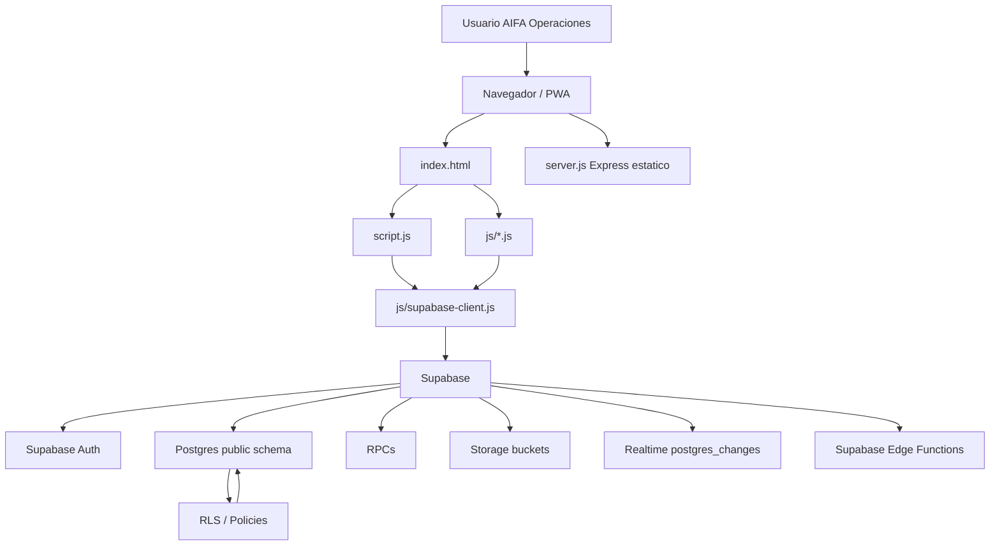

## 2. Frontend y Navegacion por Secciones

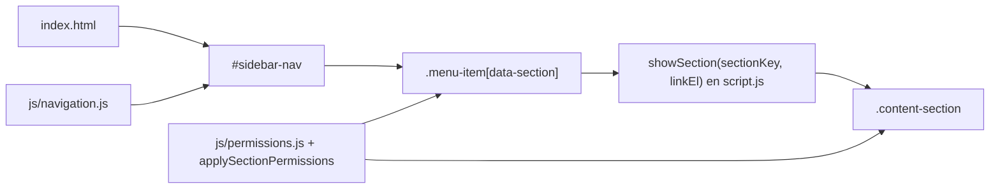

## 3. Modulos JS por Dominio

```mermaid
flowchart TB
  Index["index.html carga scripts"]
  Core["js/core.js"]
  SupabaseClient["js/supabase-client.js"]
  Realtime["js/realtime.js"]
  Navigation["js/navigation.js"]
  Permissions["js/permissions.js"]
  Notifications["js/notifications.js"]

  Ops["Operaciones: script.js, js/operaciones.js, js/parte-ops-tab.js, js/parte-ops-flights.js, js/analisis-mensual.js, js/analisis-anual.js"]
  Itinerary["Itinerario/FIDS: js/itinerario.js, js/itinerario-tab.js, js/fids.js"]
  Manifests["Manifiestos: js/manifiestos.js, js/manifiestos_pax.js, js/manifiestos-carga.js, js/portal-manifiestos.js"]
  Agenda["Agenda: js/agenda.js, js/agenda-assistant.js"]
  Admin["Admin: script.js, js/admin-ui.js, js/data-management.js"]
  Biblioteca["Biblioteca: #biblioteca-section en index.html"]
  Services["Servicios: js/fauna.js, js/medicas.js, js/hvac.js, js/ssei-derrames.js, js/ssei-emergencias.js"]

  Index --> Core
  Index --> SupabaseClient
  Index --> Realtime
  Index --> Navigation
  Index --> Permissions
  Index --> Notifications
  Index --> Ops
  Index --> Itinerary
  Index --> Manifests
  Index --> Agenda
  Index --> Admin
  Index --> Biblioteca
  Index --> Services
```

## 4. Supabase: Datos, RPC, Storage, Realtime y Functions

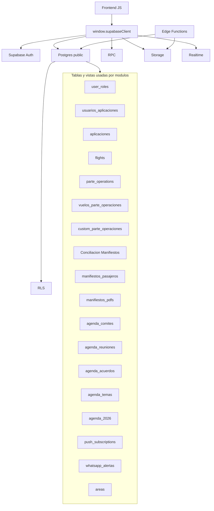

## 5. Autenticacion y Compuerta OPERACIONES

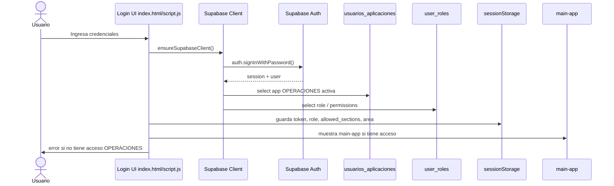

## 6. RLS y Modelo de Permisos

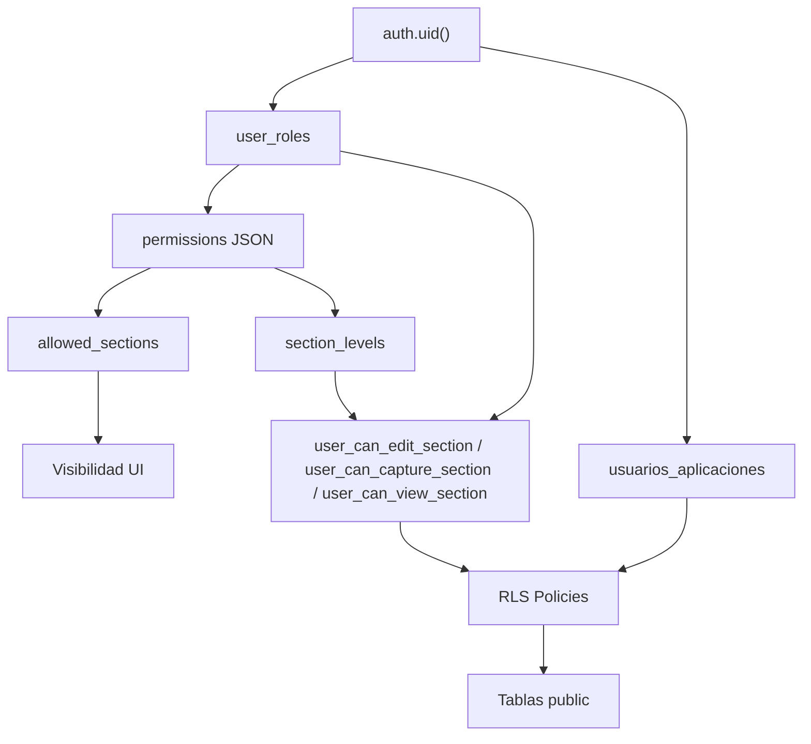

## 7. Administracion de Usuarios

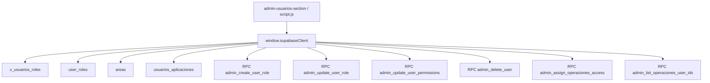

## 8. Agenda, Notificaciones y WhatsApp

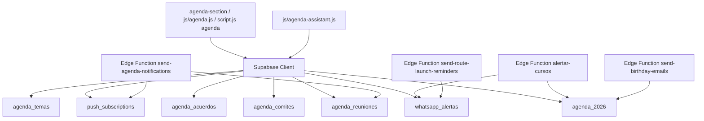

## 9. Manifiestos y Conciliacion

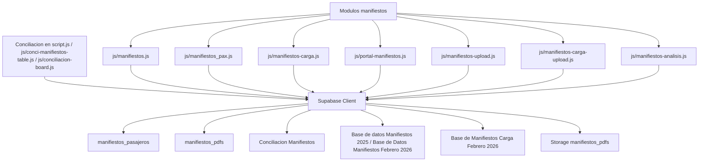

## 10. Operaciones, Itinerario, Parte y FIDS

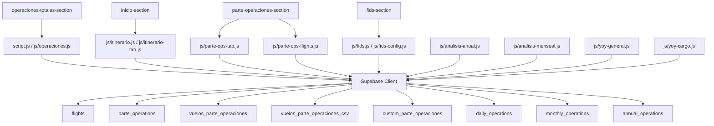

## 11. Biblioteca

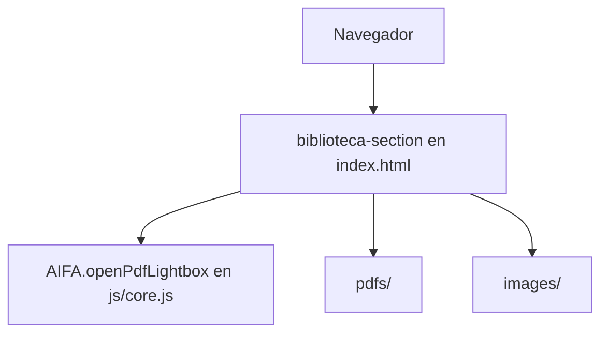

## 12. Asistentes IA Existentes

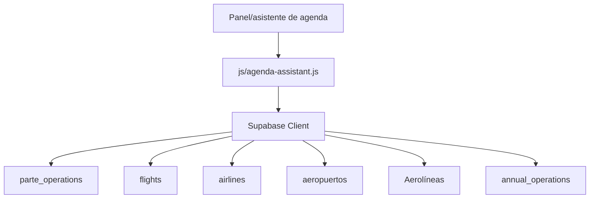

## 13. Realtime y Recarga de Modulos

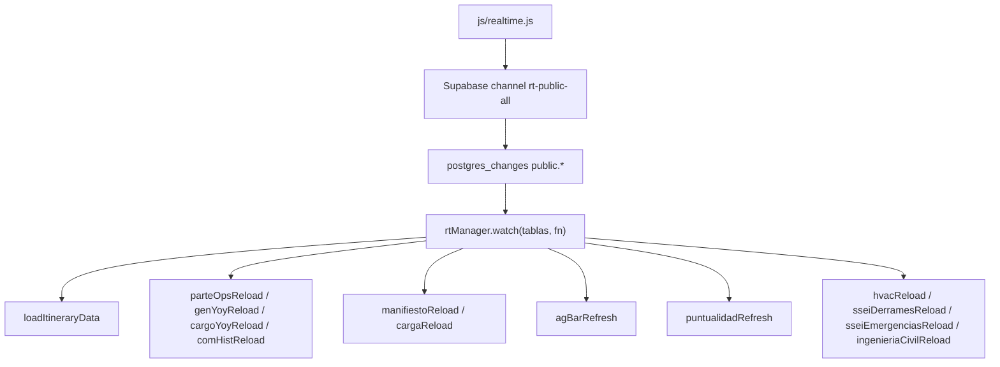

