# Flujo DevOps Propuesto - AIFA Operaciones

Fecha: 2026-07-22

## Objetivo del documento

Disenar un flujo DevOps para este repositorio: validacion local, pruebas, revision SQL/RLS, seguridad, documentacion, versionado, despliegue y rollback.

## Estado actual que considera

El repo usa app web estatica, `server.js` Express y `package.json` con:

- `npm run dev`
- `npm start`
- `npm test`

Hay SQL distribuido en `db/`, `migrations/`, `supabase/migrations/`, `sql_fresh/` y scripts auxiliares.

## Para que debe usarlo una IA

Para preparar cambios futuros sin ejecutar despliegues, sin correr migraciones no aprobadas y sin modificar permisos productivos.

## Flujo recomendado

```mermaid
flowchart LR
  Spec["OpenSpec"]
  Local["Validacion local"]
  Tests["Pruebas"]
  SQL["Revision SQL/RLS"]
  Sec["Checklist seguridad"]
  Docs["Documentacion"]
  Review["Revision humana"]
  Deploy["Despliegue"]
  Smoke["Smoke post-deploy"]
  Rollback["Rollback si falla"]

  Spec --> Local
  Local --> Tests
  Tests --> SQL
  SQL --> Sec
  Sec --> Docs
  Docs --> Review
  Review --> Deploy
  Deploy --> Smoke
  Smoke --> Rollback
```



## 1. Validacion local

Comandos actuales:

```bash
npm install
npm run dev
```

Validaciones:

- app carga en servidor local;
- login no rompe;
- no hay errores bloqueantes en consola;
- modulo afectado abre por menu;
- responsive basico.

## 2. Pruebas

Comando actual:

```bash
npm test
```

Requisitos futuros:

- pruebas unitarias para funciones nuevas;
- pruebas de contrato DOM;
- pruebas de parsing;
- smoke manual documentado.

## 3. Revision SQL

Antes de cualquier SQL:

- identificar archivo SQL nuevo o modificado;
- confirmar si es migracion, setup, seed o script historico;
- revisar `create table`, `alter table`, `drop`, `delete`, `truncate`;
- exigir rollback;
- exigir impacto en datos existentes.

## 4. Revision RLS

Checklist:

- RLS activado en tablas nuevas;
- `anon` no tiene escritura;
- `authenticated` no tiene escritura amplia sin justificacion;
- usa `user_can_view_section`, `user_can_capture_section`, `user_can_edit_section` si aplica;
- RPC sensible valida rol;
- `SECURITY DEFINER` incluye `set search_path`;
- grants explicitos;
- `PUBLIC` revocado en RPC sensible.

## 5. Checklist de seguridad

- no secretos en codigo;
- no tokens en docs;
- no prompts con datos sensibles;
- no logs con PII innecesaria;
- no uploads sin validacion;
- no cambios en usuarios/permisos sin doble revision;
- no exposicion accidental de documentos.

## 6. Generacion de documentacion

Todo cambio relevante debe actualizar:

- OpenSpec;
- contrato de modulo;
- matriz de permisos;
- pruebas;
- rollback;
- Mermaid si cambia arquitectura;
- README funcional si aplica.

## 7. Versionado

Propuesta:

- cambios UI/documentacion: version menor interna;
- cambios Supabase/RLS: version de migracion;
- cambios asistentes IA: version de asistente;
- cambios RAG: version de indice/documento.

Convencion recomendada:

```text
YYYYMMDD_<area>_<descripcion>.sql
YYYYMMDD_<modulo>_<descripcion>.md
```

## 8. Despliegue

Antes de deploy:

- pruebas ejecutadas;
- SQL revisado;
- RLS revisado;
- rollback listo;
- responsable funcional aprueba;
- smoke plan preparado.

Despues de deploy:

- login;
- navegacion principal;
- modulo afectado;
- usuario restringido;
- consola sin errores bloqueantes;
- Supabase sin errores RLS inesperados.

## 9. Rollback

Rollback debe definir:

- archivos a revertir;
- migraciones reversibles;
- backups requeridos;
- politicas RLS previas;
- feature flag o desactivacion visual;
- responsable.

## Bloqueadores actuales

- No hay pipeline CI documentado.
- No hay ambiente Supabase local/test formalizado.
- SQL esta distribuido en varias carpetas.
- No hay comando lint actual.
- No hay smoke automatizado en `package.json`.

