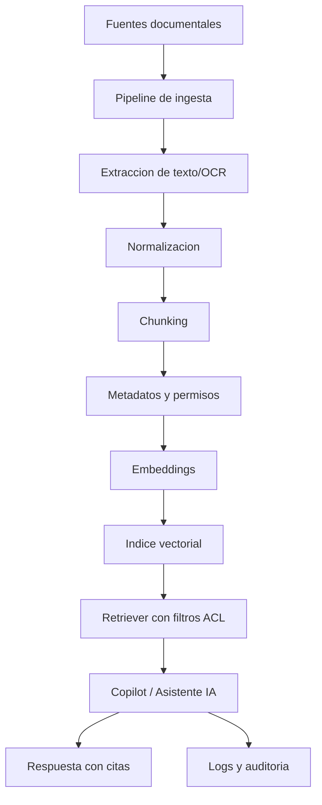

# Plan RAG - Biblioteca Digital y Documentos Internos AIFA Operaciones

Fecha: 2026-07-22

## 1. Proposito

Definir un plan RAG (Retrieval-Augmented Generation) para AIFA Operaciones usando la Biblioteca Digital, PDFs, guias operativas, itinerarios y documentos internos.

Este documento es una base normativa para futuros asistentes IA/copilots. No modifica la aplicacion actual ni asume que la infraestructura RAG ya exista.

## 2. Objetivos

- Permitir busqueda semantica sobre documentos operativos.
- Responder preguntas citando fuentes internas verificables.
- Apoyar a usuarios en procedimientos, itinerarios, reportes y consulta documental.
- Respetar permisos por usuario, modulo, area y documento.
- Evitar exponer informacion sensible fuera del alcance autorizado.
- Mantener trazabilidad de documento, version, pagina y fecha.

## 3. Alcance Inicial

Fuentes candidatas observadas en el repositorio:

- `pdfs/`: PDFs operativos y directorios.
- `pdfs/directorio/`: documentos de directorio y resguardo.
- `excel/`: archivos XLSX con reportes/correos/itinerarios.
- `data/`: datos JSON y catalogos.
- `data/master/`: catalogos maestros.
- `images/Manifiestos/` y `examples/`: ejemplos visuales para referencia operativa.
- `COLAB_ONBOARDING_QR.md`, `DEPLOY_FIDS_OPSWALL.md` y documentos Markdown existentes.
- `docs/ai-methodology/`: metodologia, arquitectura, OpenSpec, reportes y playbooks.
- Itinerarios en `pdfs/itinerario_mensual.pdf`, `pdfs/itinerario_completo.pdf`, `pdfs/Itinerario.pdf`.
- Guias como `pdfs/Guia de Acceso Rapido.pdf` si se encuentra con nombre normalizado o equivalente.

Fuera de alcance inicial:

- Indexar credenciales, tokens, llaves o archivos `.env`.
- Indexar backups binarios.
- Indexar videos.
- Indexar datos personales sensibles sin matriz de permisos.
- Usar RAG para ejecutar acciones; RAG solo responde y cita.

## 4. Arquitectura Conceptual



## 5. Fuentes Documentales

### 5.1 Biblioteca Digital

Uso esperado:

- consultas sobre documentos disponibles al usuario;
- guias de acceso rapido;
- PDFs informativos;
- directorios;
- documentos operativos.

Requisito:

- cada documento debe tener propietario, nivel de acceso, version y fecha.

### 5.2 PDFs

Tipos esperados:

- itinerarios;
- guias;
- formatos;
- directorios;
- reportes;
- actas;
- comparativas.

Procesamiento:

- extraccion de texto por pagina;
- OCR solo si el PDF es imagen;
- preservar numero de pagina;
- preservar nombre de archivo;
- generar hash de archivo para detectar cambios.

### 5.3 Guias Operativas

Uso esperado:

- responder procedimientos;
- explicar pasos;
- generar checklist;
- ubicar responsables o areas.

Requisito:

- version vigente claramente marcada;
- fecha de revision;
- area responsable.

### 5.4 Itinerarios

Fuentes:

- PDFs de itinerario;
- datos de `flights`;
- documentos mensuales o completos.

Uso esperado:

- consulta por fecha, aerolinea, destino o tipo de vuelo;
- explicacion de cambios;
- apoyo a operaciones.

Precaucion:

- distinguir itinerario documental de datos vivos en Supabase.
- indicar fecha de corte.

### 5.5 Documentos Internos

Incluye:

- metodologia IA;
- documentacion tecnica;
- manuales internos;
- reportes;
- directorios;
- documentos de areas.

Requisito:

- clasificacion documental antes de indexar.

## 6. Clasificacion de Documentos

| Nivel | Descripcion | Ejemplos | Acceso |
|---|---|---|---|
| Publico interno | Documento operativo no sensible | guias generales, instructivos | usuarios autenticados |
| Area | Documento de una direccion/subdireccion | reportes internos de area | usuarios del area y admin |
| Restringido | Documento con datos personales u operativos sensibles | directorios, manifiestos, reportes especiales | roles especificos |
| Critico | Seguridad, usuarios, permisos, datos medicos, llaves | credenciales, roles, salud | no indexar por defecto |

## 7. Metadatos Obligatorios

Cada documento:

```json
{
  "document_id": "uuid-o-hash",
  "title": "Nombre legible",
  "source_path": "pdfs/itinerario_mensual.pdf",
  "source_type": "pdf",
  "module": "biblioteca",
  "area": "DO",
  "classification": "publico_interno",
  "owner": "Direccion de Operacion",
  "version": "2026-07",
  "effective_date": "2026-07-01",
  "indexed_at": "2026-07-22T00:00:00Z",
  "file_hash": "sha256",
  "language": "es-MX",
  "permissions": {
    "allowed_sections": ["biblioteca"],
    "roles": ["viewer", "editor", "admin", "superadmin"],
    "areas": ["DO"]
  }
}
```

Cada chunk:

```json
{
  "chunk_id": "uuid",
  "document_id": "uuid-o-hash",
  "chunk_index": 12,
  "page_start": 4,
  "page_end": 5,
  "section_heading": "Procedimiento",
  "text_hash": "sha256",
  "token_count": 650,
  "classification": "publico_interno",
  "source_path": "pdfs/itinerario_mensual.pdf"
}
```

## 8. Chunking

### 8.1 Regla general

- Chunk objetivo: 500 a 900 tokens.
- Overlap: 80 a 150 tokens.
- Mantener limites por pagina cuando sea posible.
- No mezclar documentos distintos en un mismo chunk.
- No mezclar clasificaciones diferentes.

### 8.2 PDFs

Prioridad de corte:

1. encabezados/secciones;
2. pagina;
3. parrafos;
4. tablas convertidas a texto;
5. limite de tokens.

Metadatos por chunk:

- pagina inicial;
- pagina final;
- titulo del documento;
- heading detectado;
- fecha/version si aparece.

### 8.3 Tablas e itinerarios

No fragmentar filas criticas.

Representacion recomendada:

```text
Fecha: 2026-07-01
Aerolinea: Mexicana
Vuelo: MXA123
Origen: NLU
Destino: CUN
Hora programada: 10:30
Tipo: Salida nacional
Fuente: Itinerario mensual, pagina 3
```

### 8.4 Guias operativas

Separar por procedimiento:

- objetivo;
- responsables;
- prerequisitos;
- pasos;
- excepciones;
- anexos.

## 9. Embeddings

### 9.1 Requisitos

- Usar embeddings multilingues o robustos en espanol.
- Mantener version del modelo de embedding en metadatos.
- Recalcular embeddings cuando cambie el texto o modelo.
- No generar embeddings de documentos criticos no autorizados.

### 9.2 Tabla conceptual de embeddings

Campos sugeridos:

- `id`
- `document_id`
- `chunk_id`
- `content`
- `embedding`
- `metadata`
- `classification`
- `area`
- `allowed_roles`
- `allowed_sections`
- `created_at`
- `updated_at`
- `source_hash`
- `embedding_model`

### 9.3 Control de acceso

El filtro de permisos debe ocurrir antes de entregar chunks al modelo generativo.

Nunca confiar solo en el prompt para ocultar informacion.

## 10. Busqueda Semantica

### 10.1 Flujo

1. Usuario pregunta.
2. Se identifica usuario, rol, area y seccion activa.
3. Se aplican filtros ACL.
4. Se genera embedding de la pregunta.
5. Se buscan chunks relevantes.
6. Se reordena por relevancia, fecha y permisos.
7. Se construye respuesta con citas.
8. Se registra evento de consulta.

### 10.2 Filtros obligatorios

- `classification`;
- `allowed_roles`;
- `allowed_sections`;
- `area`;
- `document_status = vigente`;
- `app = OPERACIONES` si aplica.

### 10.3 Ranking recomendado

Prioridad:

1. coincidencia semantica;
2. documento vigente;
3. documento del modulo activo;
4. documento del area del usuario;
5. fecha mas reciente;
6. autoridad de fuente.

## 11. Citas y Respuestas

Toda respuesta RAG debe incluir:

- titulo del documento;
- archivo o ruta;
- pagina o seccion;
- fecha/version;
- indicador si hay incertidumbre.

Formato recomendado:

```text
Respuesta breve...

Fuentes:
- Guia de Acceso Rapido, pdfs/..., pag. 4, version 2026-06.
- Itinerario mensual, pdfs/itinerario_mensual.pdf, pag. 2, corte 2026-07.
```

Reglas:

- Si no hay fuente suficiente, responder "no encontre evidencia suficiente".
- No inventar procedimientos.
- No responder con documentos fuera del permiso del usuario.
- No citar documentos no usados.

## 12. Actualizacion e Ingesta

### 12.1 Tipos de actualizacion

- Manual: admin sube o registra documento.
- Programada: revision diaria/semanal de cambios.
- Por hash: reindexar solo si cambia el archivo.
- Por version: desactivar version anterior y activar nueva.

### 12.2 Estados de documento

- `draft`
- `active`
- `superseded`
- `archived`
- `blocked`

Solo `active` debe responder al usuario final por defecto.

### 12.3 Pipeline

1. Registrar documento.
2. Clasificar documento.
3. Validar permisos.
4. Extraer texto.
5. Revisar calidad OCR.
6. Chunking.
7. Generar embeddings.
8. Activar indice.
9. Registrar log.

## 13. Privacidad y Seguridad

### 13.1 No indexar por defecto

- secretos;
- tokens;
- llaves API;
- contrasenas;
- backups;
- datos medicos nominativos;
- documentos de usuarios/roles;
- evidencias sensibles sin permiso explicito.

### 13.2 Protecciones

- ACL por documento y chunk.
- RLS en tablas de documentos y embeddings.
- Auditoria de consultas.
- Redaccion de PII cuando no sea necesaria.
- Limites de respuesta.
- No enviar documentos completos al modelo si solo se requieren chunks.
- Separar indices por clasificacion si es necesario.

### 13.3 Logging

Registrar:

- usuario;
- rol;
- area;
- pregunta hash o resumen;
- documentos recuperados;
- chunks usados;
- respuesta generada hash/resumen;
- timestamp;
- modulo;
- resultado.

No registrar:

- pregunta completa si contiene datos sensibles;
- tokens;
- documentos completos;
- datos personales no necesarios.

## 14. Permisos por Documento

### 14.1 Modelo recomendado

Cada documento debe declarar:

- roles permitidos;
- areas permitidas;
- secciones permitidas;
- clasificacion;
- propietario;
- estado.

### 14.2 Integracion con permisos existentes

Debe respetar:

- `user_roles.role`;
- `user_roles.permissions.allowed_sections`;
- `user_roles.permissions.section_levels`;
- `user_roles.permissions.area`;
- `usuarios_aplicaciones` con acceso `OPERACIONES`.

### 14.3 Politica conceptual

Un usuario puede recuperar un chunk si:

- tiene acceso activo a `OPERACIONES`;
- esta autenticado;
- su rol o area coincide con ACL del documento;
- tiene acceso a la seccion/modulo relacionado;
- el documento esta activo;
- la clasificacion permite consulta.

## 15. Casos de Uso Iniciales

### Biblioteca

- "Busca el procedimiento para..."
- "Resume esta guia..."
- "Que documento habla de..."

### Operaciones

- "Explica el itinerario de este mes..."
- "Que cambios relevantes hay en el itinerario..."

### Agenda

- "Que acuerdos estan pendientes segun los documentos..."
- "Genera un resumen de la sesion..."

### Documentacion tecnica

- "Como se debe crear un modulo nuevo..."
- "Que reglas RLS aplican..."
- "Cual es la plantilla OpenSpec..."

## 16. QA para RAG

Pruebas minimas:

- pregunta con fuente existente;
- pregunta sin fuente;
- usuario sin permiso;
- usuario de otra area;
- documento archivado;
- documento reemplazado;
- PDF escaneado con OCR malo;
- documento con acentos;
- itinerario con tablas;
- respuesta con cita correcta.

Metricas:

- precision de recuperacion;
- tasa de respuestas con fuente;
- tasa de "no se encontro evidencia";
- latencia;
- documentos obsoletos recuperados;
- incidentes de permisos.

## 17. Riesgos

- Recuperar documentos sin permiso.
- Responder con informacion obsoleta.
- Confundir itinerario historico con vigente.
- OCR incorrecto.
- Citas inexactas.
- Exponer datos personales.
- Mezclar fuentes oficiales con borradores.

## 18. Criterios de Aceptacion

- [ ] Cada documento tiene metadatos obligatorios.
- [ ] Cada chunk conserva fuente y pagina.
- [ ] La busqueda filtra permisos antes de generar respuesta.
- [ ] Las respuestas incluyen citas.
- [ ] Los documentos archivados no se usan por defecto.
- [ ] Hay logging sin datos sensibles.
- [ ] Hay pruebas para usuario sin permiso.
- [ ] Hay proceso de reindexacion por hash/version.
- [ ] Hay matriz de clasificacion documental.
- [ ] La IA responde "no encontre evidencia suficiente" cuando aplique.

## 19. Prompt de Sistema Recomendado para Copilot RAG

```text
Eres un asistente documental de AIFA Operaciones. Responde solo con informacion recuperada de documentos autorizados para el usuario. Cita siempre documento, ruta, pagina o seccion y fecha/version cuando exista. Si no hay evidencia suficiente, dilo claramente. No inventes procedimientos, fechas, responsables ni permisos. Distingue dato confirmado de inferencia. No muestres informacion fuera del permiso del usuario.
```

