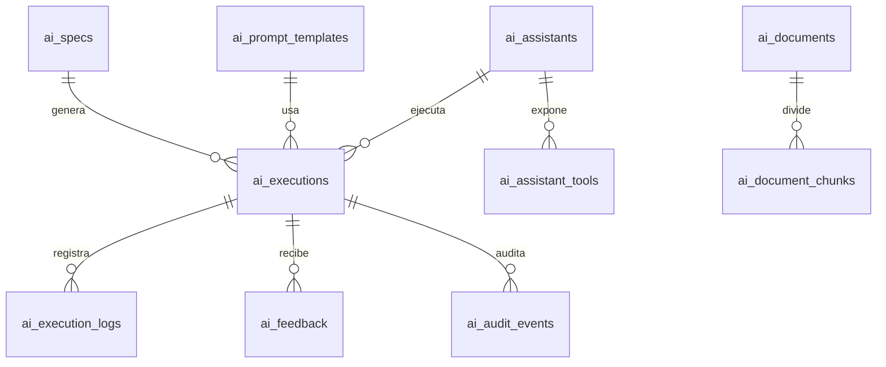

# Modelo de Datos Supabase Propuesto - Metodologia IA

Fecha: 2026-07-22

## Objetivo del documento

Proponer un modelo de datos Supabase para integrar la metodologia IA dentro de AIFA Operaciones: specs, prompts, asistentes, ejecuciones, logs, feedback, documentos indexados, chunks RAG, permisos y auditoria.

## Estado actual que considera

El sistema actual usa Supabase Auth, `user_roles.permissions.allowed_sections`, `user_roles.permissions.section_levels`, compuerta `usuarios_aplicaciones` para `OPERACIONES`, RPCs `SECURITY DEFINER`, RLS y modulos navegados por `data-section`.

Este documento no ejecuta migraciones. Las sentencias SQL son sugeridas para una futura revision tecnica.

## Para que debe usarlo una IA

- Para disenar futuras tablas de metodologia IA sin inventar permisos.
- Para proponer migraciones SQL alineadas con el modelo actual.
- Para razonar sobre RLS antes de crear asistentes, logs o RAG.

## Que NO debe asumir

- No asumir que estas tablas existen.
- No ejecutar SQL.
- No relajar RLS existente.
- No almacenar prompts completos si contienen datos sensibles.

## Esquema propuesto

Tablas propuestas:

- `ai_specs`
- `ai_prompt_templates`
- `ai_assistants`
- `ai_assistant_tools`
- `ai_executions`
- `ai_execution_logs`
- `ai_feedback`
- `ai_documents`
- `ai_document_chunks`
- `ai_audit_events`

## Relaciones principales



## Tablas

### `ai_specs`

Almacena especificaciones OpenSpec de nuevas funcionalidades o cambios.

Campos sugeridos:

- `id uuid primary key`
- `title text`
- `slug text unique`
- `section_key text`
- `status text`
- `risk_level text`
- `owner_user_id uuid`
- `owner_area text`
- `spec_md text`
- `metadata jsonb`
- `created_by uuid`
- `updated_by uuid`
- `created_at timestamptz`
- `updated_at timestamptz`

### `ai_prompt_templates`

Biblioteca versionada de prompts estandar.

Campos sugeridos:

- `id uuid primary key`
- `name text`
- `category text`
- `section_key text`
- `prompt_text text`
- `required_inputs jsonb`
- `expected_output text`
- `risk_level text`
- `version text`
- `status text`
- `created_by uuid`
- `created_at timestamptz`

### `ai_assistants`

Registro de asistentes/copilots disponibles.

Campos sugeridos:

- `id uuid primary key`
- `name text`
- `section_key text`
- `description text`
- `mode text` (`read`, `draft`, `action`)
- `supports_voice boolean`
- `status text`
- `permission_policy jsonb`
- `created_by uuid`
- `created_at timestamptz`

### `ai_assistant_tools`

Herramientas disponibles por asistente.

Campos sugeridos:

- `id uuid primary key`
- `assistant_id uuid`
- `name text`
- `tool_type text`
- `risk_level text`
- `required_level text`
- `tables_used text[]`
- `actions_allowed text[]`
- `metadata jsonb`
- `enabled boolean`

### `ai_executions`

Registro de consultas o ejecuciones IA.

Campos sugeridos:

- `id uuid primary key`
- `assistant_id uuid`
- `spec_id uuid null`
- `prompt_template_id uuid null`
- `user_id uuid`
- `section_key text`
- `execution_type text`
- `risk_level text`
- `input_hash text`
- `input_summary text`
- `output_summary text`
- `status text`
- `metadata jsonb`
- `created_at timestamptz`

### `ai_execution_logs`

Eventos tecnicos de cada ejecucion.

Campos sugeridos:

- `id uuid primary key`
- `execution_id uuid`
- `event_type text`
- `message text`
- `metadata jsonb`
- `created_at timestamptz`

### `ai_feedback`

Retroalimentacion humana.

Campos sugeridos:

- `id uuid primary key`
- `execution_id uuid`
- `user_id uuid`
- `rating int`
- `label text`
- `comment text`
- `created_at timestamptz`

### `ai_documents`

Registro de documentos indexables para RAG.

Campos sugeridos:

- `id uuid primary key`
- `title text`
- `source_path text`
- `source_type text`
- `section_key text`
- `area text`
- `classification text`
- `status text`
- `owner text`
- `version text`
- `effective_date date`
- `file_hash text`
- `permissions jsonb`
- `metadata jsonb`
- `created_at timestamptz`
- `updated_at timestamptz`

### `ai_document_chunks`

Chunks de documentos para busqueda semantica.

Campos sugeridos:

- `id uuid primary key`
- `document_id uuid`
- `chunk_index int`
- `content text`
- `embedding vector`
- `page_start int`
- `page_end int`
- `text_hash text`
- `token_count int`
- `metadata jsonb`
- `created_at timestamptz`

Nota: `embedding vector` requiere extension vectorial en Supabase. Si no esta disponible, usar una tabla sin columna vector y documentar la integracion futura.

### `ai_audit_events`

Auditoria de acciones IA relevantes.

Campos sugeridos:

- `id uuid primary key`
- `execution_id uuid null`
- `user_id uuid`
- `section_key text`
- `event_type text`
- `risk_level text`
- `target_table text`
- `target_record_id text`
- `before_hash text`
- `after_hash text`
- `metadata jsonb`
- `created_at timestamptz`

## RLS por rol/seccion

Principio: toda lectura/escritura debe respetar `OPERACIONES`, `allowed_sections`, `section_levels` y rol global.

Reglas recomendadas:

- `superadmin`, `admin`: lectura total y administracion de metodologia IA.
- `editor`: crear specs/prompts en secciones donde tenga nivel `edit`.
- `capturista`: crear feedback y ejecuciones propias.
- `viewer`/`lector`: leer documentos y prompts autorizados por seccion.
- usuario comun: solo ver sus propias ejecuciones/logs resumidos.

## Helpers SQL sugeridos

```sql
-- SUGERIDO. No ejecutar sin revision.
create or replace function public.ai_user_can_view_section(p_section text)
returns boolean
language sql
stable
security definer
set search_path = public
as $$
  select public.user_can_view_section(p_section);
$$;

create or replace function public.ai_user_can_edit_section(p_section text)
returns boolean
language sql
stable
security definer
set search_path = public
as $$
  select public.user_can_edit_section(p_section);
$$;
```

## Migracion SQL sugerida

```sql
-- SUGERIDO. No ejecutar sin revision funcional, seguridad y respaldo.

create table if not exists public.ai_specs (
  id uuid primary key default gen_random_uuid(),
  title text not null,
  slug text unique not null,
  section_key text not null,
  status text not null default 'draft',
  risk_level text not null default 'medium',
  owner_user_id uuid references auth.users(id),
  owner_area text,
  spec_md text not null,
  metadata jsonb not null default '{}'::jsonb,
  created_by uuid references auth.users(id),
  updated_by uuid references auth.users(id),
  created_at timestamptz not null default now(),
  updated_at timestamptz not null default now()
);

create table if not exists public.ai_prompt_templates (
  id uuid primary key default gen_random_uuid(),
  name text not null,
  category text not null,
  section_key text,
  prompt_text text not null,
  required_inputs jsonb not null default '{}'::jsonb,
  expected_output text,
  risk_level text not null default 'low',
  version text not null default '1.0.0',
  status text not null default 'active',
  created_by uuid references auth.users(id),
  created_at timestamptz not null default now()
);

create table if not exists public.ai_assistants (
  id uuid primary key default gen_random_uuid(),
  name text not null,
  section_key text not null,
  description text,
  mode text not null default 'read',
  supports_voice boolean not null default false,
  status text not null default 'draft',
  permission_policy jsonb not null default '{}'::jsonb,
  created_by uuid references auth.users(id),
  created_at timestamptz not null default now()
);

create table if not exists public.ai_assistant_tools (
  id uuid primary key default gen_random_uuid(),
  assistant_id uuid not null references public.ai_assistants(id) on delete cascade,
  name text not null,
  tool_type text not null,
  risk_level text not null default 'low',
  required_level text not null default 'read',
  tables_used text[] not null default '{}',
  actions_allowed text[] not null default '{}',
  metadata jsonb not null default '{}'::jsonb,
  enabled boolean not null default true
);

create table if not exists public.ai_executions (
  id uuid primary key default gen_random_uuid(),
  assistant_id uuid references public.ai_assistants(id),
  spec_id uuid references public.ai_specs(id),
  prompt_template_id uuid references public.ai_prompt_templates(id),
  user_id uuid not null references auth.users(id),
  section_key text not null,
  execution_type text not null,
  risk_level text not null default 'low',
  input_hash text,
  input_summary text,
  output_summary text,
  status text not null default 'completed',
  metadata jsonb not null default '{}'::jsonb,
  created_at timestamptz not null default now()
);

create table if not exists public.ai_execution_logs (
  id uuid primary key default gen_random_uuid(),
  execution_id uuid not null references public.ai_executions(id) on delete cascade,
  event_type text not null,
  message text,
  metadata jsonb not null default '{}'::jsonb,
  created_at timestamptz not null default now()
);

create table if not exists public.ai_feedback (
  id uuid primary key default gen_random_uuid(),
  execution_id uuid not null references public.ai_executions(id) on delete cascade,
  user_id uuid not null references auth.users(id),
  rating int check (rating between 1 and 5),
  label text,
  comment text,
  created_at timestamptz not null default now()
);

create table if not exists public.ai_documents (
  id uuid primary key default gen_random_uuid(),
  title text not null,
  source_path text not null,
  source_type text not null,
  section_key text not null,
  area text,
  classification text not null default 'publico_interno',
  status text not null default 'draft',
  owner text,
  version text,
  effective_date date,
  file_hash text,
  permissions jsonb not null default '{}'::jsonb,
  metadata jsonb not null default '{}'::jsonb,
  created_at timestamptz not null default now(),
  updated_at timestamptz not null default now()
);

create table if not exists public.ai_document_chunks (
  id uuid primary key default gen_random_uuid(),
  document_id uuid not null references public.ai_documents(id) on delete cascade,
  chunk_index int not null,
  content text not null,
  page_start int,
  page_end int,
  text_hash text,
  token_count int,
  metadata jsonb not null default '{}'::jsonb,
  created_at timestamptz not null default now(),
  unique(document_id, chunk_index)
);

create table if not exists public.ai_audit_events (
  id uuid primary key default gen_random_uuid(),
  execution_id uuid references public.ai_executions(id),
  user_id uuid references auth.users(id),
  section_key text,
  event_type text not null,
  risk_level text not null default 'low',
  target_table text,
  target_record_id text,
  before_hash text,
  after_hash text,
  metadata jsonb not null default '{}'::jsonb,
  created_at timestamptz not null default now()
);
```

## RLS sugerida

```sql
-- SUGERIDO. No ejecutar sin revision.

alter table public.ai_specs enable row level security;
alter table public.ai_prompt_templates enable row level security;
alter table public.ai_assistants enable row level security;
alter table public.ai_assistant_tools enable row level security;
alter table public.ai_executions enable row level security;
alter table public.ai_execution_logs enable row level security;
alter table public.ai_feedback enable row level security;
alter table public.ai_documents enable row level security;
alter table public.ai_document_chunks enable row level security;
alter table public.ai_audit_events enable row level security;

create policy ai_specs_select
on public.ai_specs for select to authenticated
using (public.user_can_view_section(section_key));

create policy ai_specs_write
on public.ai_specs for all to authenticated
using (public.user_can_edit_section(section_key))
with check (public.user_can_edit_section(section_key));

create policy ai_prompts_select
on public.ai_prompt_templates for select to authenticated
using (section_key is null or public.user_can_view_section(section_key));

create policy ai_prompts_write_admin
on public.ai_prompt_templates for all to authenticated
using (public.user_access_level() = 'admin')
with check (public.user_access_level() = 'admin');

create policy ai_assistants_select
on public.ai_assistants for select to authenticated
using (public.user_can_view_section(section_key));

create policy ai_assistants_write_admin
on public.ai_assistants for all to authenticated
using (public.user_access_level() = 'admin')
with check (public.user_access_level() = 'admin');

create policy ai_executions_own_select
on public.ai_executions for select to authenticated
using (user_id = auth.uid() or public.user_access_level() = 'admin');

create policy ai_executions_insert_own
on public.ai_executions for insert to authenticated
with check (user_id = auth.uid() and public.user_can_view_section(section_key));

create policy ai_feedback_own
on public.ai_feedback for all to authenticated
using (user_id = auth.uid() or public.user_access_level() = 'admin')
with check (user_id = auth.uid());

create policy ai_documents_select
on public.ai_documents for select to authenticated
using (
  status = 'active'
  and public.user_can_view_section(section_key)
);

create policy ai_documents_write_admin
on public.ai_documents for all to authenticated
using (public.user_access_level() = 'admin')
with check (public.user_access_level() = 'admin');

create policy ai_chunks_select
on public.ai_document_chunks for select to authenticated
using (
  exists (
    select 1 from public.ai_documents d
    where d.id = document_id
      and d.status = 'active'
      and public.user_can_view_section(d.section_key)
  )
);

create policy ai_audit_admin_select
on public.ai_audit_events for select to authenticated
using (public.user_access_level() = 'admin');
```

## Bloqueadores antes de implementar

- Confirmar si `public.user_access_level()` y helpers de seccion estan aplicados en Supabase productivo.
- Definir si se usara extension vectorial.
- Definir retencion de logs.
- Definir si prompts completos se almacenan o solo hashes/resumen.
- Definir matriz documental y clasificacion de privacidad.

